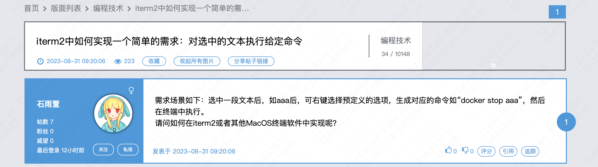

##  起因

98 上看到一个帖子



 想到 PopClip 应该可以实现，就学习了一下，插个眼，以后慢慢看

https://www.popclip.app/dev/snippets

## impl

```
#popclip
name: docker stop
interpreter: zsh
shell script: docker stop $POPCLIP_TEXT
```

