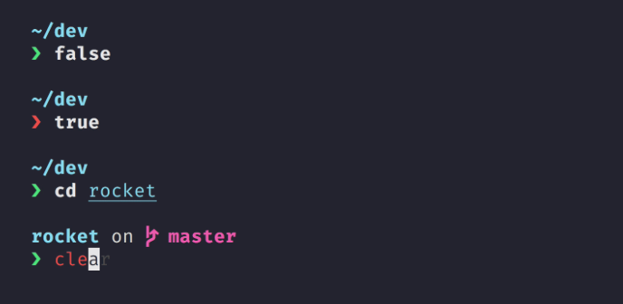
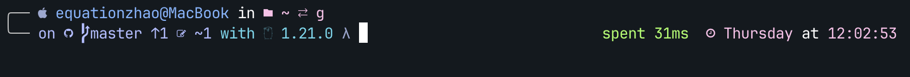
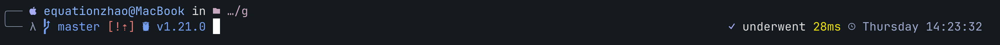

# Starship
> an alternative to omp
> 

starship 是一个使用 rust 编写的 cross-shell prompt

[官网](https://starship.rs)描述如下

**轻量、迅速、可无限定制的高颜值终端！**

- **快：** 很快 —— 真的真的非常快！ 🚀
- **定制化：** 可定制各种各样的提示符。
- **通用：** 适用于任何 Shell、任何操作系统。
- **智能：** 一目了然地显示相关信息。
- **功能丰富：** 支持所有你喜欢的工具。
- **易用：** 安装快速 —— 几分钟就可上手。

原本使用的是 oh-my-posh, 但是有点慢，所以试一下这个（好像也没快多少）

btw 如果有rust语言洁癖的话也可以用这个

## 安装

任选一种方式进行安装

### Windows 🪟

```powershell
# scoop
scoop install starship

# cargo
cargo install starship --locked

# Chocolatey
choco install starship

# winget
winget install --id Starship.Starship
```

### macOS 🍎

```bash
# homebrew
brew install starship

# MacPorts
port install starship

# cargo
cargo install starship --locked

# curl
curl -sS https://starship.rs/install.sh | sh
```

### Linux 🐧

```bash
curl -sS https://starship.rs/install.sh | sh

# 或任意包管理器
```

## 配置

### Windows/PWSH 🪟

 打开 $PROFILE `vim $PROFILE` 并添加下列语句

```powershell
Invoke-Expression (&starship init powershell)
```

### Bash/Zsh 🐚

 添加到对应的 .zshrc/.bashrc 或 profile 文件

```bash
# zsh
eval "$(starship init zsh)"
# bash
eval "$(starship init bash)"
```

### fish 🐟

 向 `~/.config/fish/config.fish` 添加以下内容

```bash
starship init fish | source
```

### nushell

<aside>
📢  以下信息来自官网

</aside>

在您的 Nushell 环境文件的最后（使用 `$nu.env-path` 来获取它的路径），添加以下内容：

`mkdir ~/.cache/starship
starship init nu | save -f ~/.cache/starship/init.nu`

然后将以下内容添加到您 Nushell 配置文件的末尾（使用 `$nu.config-path` 来获取它的路径）

`use ~/.cache/starship/init.nu`

<aside>
⚠️ 注意：仅支持 Nushell v0.78+

</aside>

## 效果

官网效果图



对比原来的 omp 主题有点简陋，所以准备做一个主题迁移



omp 定制主题

## 主题定制

starship 提供了几个 preset，可以通过以下语句设置

```bash
starship preset nerd-font-symbols -o ~/.config/starship.toml
```

访问 [https://starship.rs/zh-CN/presets](https://starship.rs/zh-CN/presets/#nerd-%E5%AD%97%E4%BD%93%E7%AC%A6%E5%8F%B7) 查看对应效果

<aside>
⚠️ 需要注意的是大部分主题需要安装设置 [nerd-font](https://www.nerdfonts.com), 可以根据自己的喜好安装

</aside>

推荐 [JetBrains Mono Nerd Font](https://github.com/ryanoasis/nerd-fonts/releases/download/v3.0.2/JetBrainsMono.zip)

### 主题自定义

主题文件位置为 `.config/starship.toml` 

不需要自定义主题的可以跳过

prompt 格式设置

`format = ...`    

eg:

$os $username 等 为组件，详见下文

```toml
format = """
[╭──](fg:#9097AE)\
$os(fg:#9198AF)\
$username\
$sudo\
$hostname\
$directory\
\n[╰── λ](fg:#9097AE) \
$git_branch\
$git_state\
$git_status\
$git_commit\
$nodejs\
$rust\
$python\
$golang\
$php\
$java\
$package\
"""
```

右侧 prompt 

<aside>
⚠️ 不是所有 shell 支持 右侧提示

</aside>

```toml
right_format = """
$status\
$cmd_duration\
$time"""
```

取消 new line

`add_newline = false`

### 组件

组件可以在 format 中使用

在配置文件中，组件的形式如下

```toml
[username]
style_user = 'fg:#8AB4FB'
style_root = 'red bold'
format = '[$user]($style)'
disabled = false
show_always = true
```

这表示 uesrname 组件的配置，所有组件都有默认配置，在配置文件中的配置是对默认配置的 override

同时要注意，有些组件的 disabled 默认属性是 true，表示默认关闭，需要配置为 false 才能开启

🛠 详见 [官方文档](https://starship.rs/zh-CN/config/#%E6%8F%90%E7%A4%BA%E7%AC%A6)

### 样例配置

[](https://github.com/Equationzhao/shell-theme/blob/main/starship.toml)

```toml
format = """
[╭──](fg:#9097AE)\
$os\
$username\
$sudo\
$hostname\
$directory\
\n[╰── λ](fg:#9097AE) \
$git_branch\
$git_state\
$git_status\
$git_commit\
$nodejs\
$rust\
$python\
$golang\
$php\
$java\
$package\
"""

right_format = """
$status\
$cmd_duration\
$time"""

add_newline = false

[username]
style_user = 'fg:#8AB4FB'
style_root = 'red bold'
format = '[$user]($style)'
disabled = false
show_always = true

[hostname]
ssh_only = false
format = '[@$hostname$ssh_symbol](fg:#8AB4FB) '
trim_at = '.companyname.com'
disabled = false
ssh_symbol = ' '

[directory]
style = "fg:#C6A8BE"
format = "in [ $path ]($style)"
truncation_length = 5
truncation_symbol = "…/"

[directory.substitutions]
"Documents" = "󰈙 "
"Downloads" = " "
"Music" = "� "
"Pictures" = " "

[git_branch]
symbol = ""
format = '[[$symbol $branch ](fg:#769ff0)]($style)'

[git_commit]
tag_disabled = false
only_detached = true
tag_symbol = '\uf412 '
format = '[\($hash$tag\)]($style) '

[git_state]
format = '[\($state( $progress_current of $progress_total)\)]($style) '
merge = '[\ue727 MERGING](bold red)'
rebase = '[\ue728 REBASING](bold red)'
revert = '[\uf0e2 REVERTING](bold red)'
cherry_pick = '[\ue29b PICKING](bold red)'

[git_status]
windows_starship = '/mnt/c/Users/username/scoop/apps/starship/current/starship.exe'

[nodejs]
symbol = ""
format = '[[$symbol ($version) ](fg:#769ff0)]($style)'

[rust]
symbol = ""
format = '[[$symbol ($version) ](fg:#769ff0)]($style)'

[golang]
symbol = ""
format = '[[$symbol ($version) ](fg:#769ff0)]($style)'

[php]
symbol = ""
format = '[[$symbol ($version) ](fg:#769ff0)]($style)'

[java]
symbol = ""
format = '[[$symbol ($version) ](fg:#769ff0)]($style)'

[python]
symbol = ""
format = '[[$symbol ($version) ](fg:#769ff0)]($style)'

[time]
disabled = false
time_format = "%A %T" # Monday Hour:Minute Format
format = '[[  $time ](fg:#a0a9cb)]($style)'

[sudo]
style = 'bold yellow'
symbol = ''
disabled = false
format = '[as $symbol ]($style)'

[status]
style = 'bold blue'
symbol = '✗'
success_symbol = '✓'
not_executable_symbol = '!'
not_found_symbol = '?'
sigint_symbol = '✗'
format = '[$symbol$common_meaning$signal_name$maybe_int]($style) '
map_symbol = true
disabled = false

[os]
format = "[$symbol ]($style)"
style = "bold blue"
disabled = false

[os.symbols]
Windows = " "
Macos = " "

[cmd_duration]
min_time = 10
format = 'underwent [$duration](bold yellow)'

[package]
format = 'via [🎁 $version](208 bold) '
disabled = false
```

### 最终主题展示



一键安装主题

```bash
curl https://raw.githubusercontent.com/Equationzhao/shell-theme/main/catppuccin-like-starship.sh | sh
```

## 总结

starship 整体好像比 oh-my-posh 稍快一些，但是感觉整体可定制性不如omp,官方提供的主题也远没有omp丰富，还有官方文档看起来也没有 omp 舒服，但是配置写起来还是比omp简单不少

> [不过 omp 作者表示 omp 更快](https://github.com/JanDeDobbeleer/oh-my-posh/discussions/1293#discussioncomment-3021865) 🤣
>