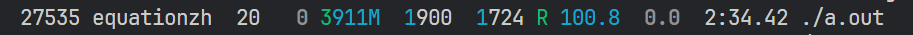

## 为什么要处理构造函数的异常

构造函数是可以抛出异常的~

ps:析构函数则必须确保异常不离开析构函数，必须在析构函数内部处理掉异常

首先给出Guidelines上提供的资料：

### How can I handle a constructor that fails?

> Throw an exception.
>
> Constructors don’t have a return type, so it’s not possible to use return codes. The best way to signal constructor failure is therefore to throw an exception. If you don’t have the option of using exceptions, the [“least bad”](https://isocpp.org/wiki/faq/big-picture#use-evil-things-sometimes) work-around is to put the object into a “zombie” state by setting an internal status bit so the object acts sort of like it’s dead even though it is technically still alive.
>
> The idea of a “zombie” object has a lot of down-side. You need to add a query (“inspector”) member function to check this “zombie” bit so users of your class can find out if their object is truly alive, or if it’s a zombie (i.e., a “living dead” object), and just about every place you construct one of your objects (including within a larger object or an array of objects) you need to check that status flag via an `if` statement. You’ll also want to add an `if` to your other member functions: if the object is a zombie, do a no-op or perhaps something more obnoxious.
>
> In practice the “zombie” thing gets pretty ugly. Certainly you should prefer exceptions over zombie objects, but if you do not have the option of using exceptions, zombie objects might be the [“least bad”](https://isocpp.org/wiki/faq/big-picture#use-evil-things-sometimes) alternative.
>
> Note: if a constructor finishes by throwing an exception, the memory associated with the object itself is cleaned up — there is no memory leak. For example:
>
> ```cpp
> void f(){  
> 	X x;    // If X::X() throws, the memory for x itself will not leak  
> 	Y* p = new Y();  // If Y::Y() throws, the memory for *p itself will not leak
> }
> ```
>
> There is some fine print on this topic, so you need to keep reading. Specifically you need to know [how to prevent memory leaks if the constructor itself allocates memory](https://isocpp.org/wiki/faq/exceptions#selfcleaning-members), and you also need to be aware of what happens if you use [“placement” `new`](https://isocpp.org/wiki/faq/dtors#placement-new) rather than the ordinary `new` used in the sample code above.

### How should I handle resources if my constructors may throw exceptions?

> Every data member inside your object should clean up its own mess.
>
> If a constructor throws an exception, the object’s destructor is *not* run. If your object has already done something that needs to be undone (such as allocating some memory, opening a file, or locking a semaphore), this “stuff that needs to be undone” *must* be remembered by a data member inside the object.
>
> For example, rather than allocating memory into a raw `Fred*` data member, put the allocated memory into a “smart pointer” member object, and the destructor of this smart pointer will `delete` the `Fred` object when the smart pointer dies. The template `std::unique_ptr` is an example of such as “smart pointer.” You can also [write your own reference counting smart pointer](https://isocpp.org/wiki/faq/freestore-mgmt#ref-count-simple). You can also [use smart pointers to “point” to disk records or objects on other machines](https://isocpp.org/wiki/faq/operator-overloading#op-ov-examples).
>
> By the way, if you think your `Fred` class is going to be allocated into a smart pointer, be nice to your users and create a `typedef` within your `Fred` class:
>
> ```cpp
> #include <memory>class Fred {public:  typedef std::unique_ptr<Fred> Ptr;  // ...};
> ```
>
> That `typedef` simplifies the syntax of all the code that uses your objects: your users can say `Fred::Ptr` instead of `std::unique_ptr<Fred>`:
>
> ```cpp
> #include "Fred.h"
> void f(std::unique_ptr<Fred> p);  // explicit but verbose
> void f(Fred::Ptr p);  // simpler
> void g(){
>    std::unique_ptr<Fred> p1( new Fred() );  // explicit but verbose 
>    Fred::Ptr p2( new Fred() );  // simpler  
>   // ...
> }
> ```

总结一下，在构造函数失败时，可以使用一个标志位来表示‘这个对象构造失败了’，或者选择抛出异常，抛出异常后需要清理构造函数申请的资源，比如一个 ctor中 为int指针开辟了新的空间并让其指向此空间，或者一个new了一个对象，这些统统都需要清理。

举例：

对于一般会抛出异常的函数，我们只需要在外层用try-catch环绕即可

下面定义一个简单的除法函数

```cpp
double divide( const int a, const int b)
{
    if(b)
    {
          return a/static_cast<double>(b);
    }
    throw  std::runtime_error("divisor should not be Zero");
}

int main()
{
    int a{1};
    int b{0};
    try
    {
        std::cout<<divide(a,b)<<'\n';
    }
    catch(const std::exception& e)
    {
        std::cerr<<e.what()<<'\n';
    }
    return 0;
}
```

这么做好像非常安全（本文暂时不讨论使用错误码），但是我们将异常用于构造函数的时候，问题就来了

某些奇特的需求使我们要让test类在构造时第二个参数不能为0，否则抛出异常。

```cpp
class test
{
public:
  test(const int len1,const int len2)
  {
    a = new int[len1];
    if (!len2)
    {
      throw std::runtime_error("exception"); //抛出异常
    }
    b = new double[len2];
  }
  ~test()
  {
    std::cout << "destructor\n";
    delete[]a;
    delete[]b;
  }

private:
  int* a;
  double* b;
};

int main()
{
  try
  {
    test T(1024000000,0);
    //do something
  }
  catch (const std::exception& e)
  {
    std::cerr << e.what() << '\n';
  }
}
```

测试，观察输出



我们观察到，此时在`while(true)```已经离开test对象 T 的生命周期了，但是此时并没有输出“destructor”，再观察内存情况，天呐，占用了4.2G内存，你确定这是C++不是Java？（/doge）

是的，这就是C++，当在构造函数中抛出异常后，由于这是一个未完成的对象，所以并不会执行test的析构函数，导致 `a = new int[len1];`泄露(不过对于栈上的内存，并不会泄露)

那么，如何避免这一情况呢？

## 0 constructor中手动管理内存

最基本的方法

```cpp
test(const int len1, const  int len2)
 {
    a = new int[len1];
    if (!len2)
    {
      delete []a;
      throw std::runtime_error("exception"); //抛出异常
    }
    b = new double[len2];
 }
```

```cpp
//如果遇到构造函数中调用了其他可能抛出异常的函数，那么 try- catch 环绕之后在catch块中释放内存
test(const int len1, const int len2)
{
    a = new int[len1];
    b = new int[len2];
    try
    {
        ThrowAnException();
    }
    catch(const std::exception& e)
    {
        delete []a;  
        delete []b;
        throw e;
    }
}
```

## 0.1 在资源初始化前抛出异常

上面的案例可以观察到，对 `a=new int[len1]` `b=new int[len2]` 的操作是相互独立的

那么我们可以在 `a=new int[len1]`之前就进行判断，len2是否为0，若为0则抛出异常

```cpp
test(const int len1, const int len2)
  {
  
    if (!len2)
     {
       throw std::runtime_error("exception"); //抛出异常
     }
    a = new int[len1];
    b = new double[len2];
  }
```

## 1 避免主动在构造中抛出异常

个人认为这是比较有效的方法，对于那些正常来讲无法处理的异常最好不要放在constructor中，比如对于上述例子可以这样进行处理

## 1.1 使用外部函数在构造前检测

```cpp
test getInstance(const int len1,const int len2)
{
    if (!len2)
    {
        throw std::exception("xxx");
    }
    return test(len1,len2);
}
```

## 1.2 提供 init 函数，使用二段式构造

```cpp
class test
{
  test()=defualt;
  void init(int len1,int len2)
  {
    a = new int[len1];
    if (!len2)
    {
      throw std::runtime_error("exception"); //抛出异常
    }
    b = new double[len2];
  }
test(test&& rhs) noexcept:a(rhs.a),b(rhs.b)
  {
    cout << "move\n";
    rhs.b = nullptr;
    rhs.a = nullptr;
  }
  
  ~test()
  {
    std::cout << "destructor\n";
    if (a)
    {
        delete []a;
    }
  
    if (b)
    {
        delete []b;
    }
  }

private:
  int* a{nullptr};
  double* b{nullptr};
};
```

此时，只需要在构造函数之后调用init函数即可, 此时几乎任何的异常，都可以尽情地try-catch~~

```cpp
int main()
{
  try
  {
      test T;
      T.init(1024000,0);
      //do something
  }
  catch(const std::exception& e)
  {
      std::cerr<<e.what()<<'\n';
  }
}
```

但是，这又有一个问题，如果我在 `do something` 前忘记 init 了怎么办？

```cpp
test getInstance() //需要移动构造函数 （也有可能进行RVO/NRVO 返回值优化/无返回值优化）
    			//篇幅限制，请自行查阅资料了解RVO/NRVO
{
    test  T;
    T.init(len1,len2);
    return T;
}

test* getInstance(int len1,int len2)
{
    test * T =new test();
    T->init(len1,len2);
    return T;
}

//或者更加cpp style些
unique_ptr<test> getInstance(int len1,int len2)
{
    auto T = make_unique<test>();
    T->init(len1,len2);
    return T;
}
```

## 1.3 封装工厂函数

```cpp
test getInstance() //需要移动构造函数 （也有可能进行RVO/NRVO 返回值优化/无返回值优化）                //篇幅限制，请自行查阅资料了解RVO/NRVO{    test  T;    T.init(len1,len2);    return T;}test* getInstance(int len1,int len2){    test * T =new test();    T->init(len1,len2);    return T;}//或者更加cpp style些unique_ptr<test> getInstance(int len1,int len2){    auto T = make_unique<test>();    T->init(len1,len2);    return T;}
```

然后每次要创建对象时调用封装好的函数即可。

总而言之，让异常发生在constructor之外即可

## 2 使用 smart-pointer

如果在构造函数中不可避免地要抛出异常 ，那么可以考虑使用 smart pointer 成员变量来管理内存， 在 cpp style 上越走越远~

```cpp
// testImpl.h
class tesIimpl
{
public:
      testImpl(const int len1,const int len2)
      {
          a = make_unique<int[]>(len1);
          if (!len2)
          {
              throw std::runtime_error("exception");
          }
          b = make_unique<double[]>(len2);
      }
      Impl()
      {
         //  doSomethingHere
      }
  
private:
      unique_ptr<int[]> a{};
      unique_ptr<double[]> b{};
};

// test.h
#include "testImpl.h"
class test
{
public:
  test(const int len1,const int len2)
  {
     t = make_unique<testImpl>(len1,len2);
  }

  test(test&& rhs) noexcept : t(move(rhs.t))
  {
    cout << "move\n";
  }
  
  do()
  {
      t->Impl();
  }

  ~test()
  {
      std::cout << "destructor\n";
  }

private:
  unique_ptr<testImpl> t;
};

int main()
{
    int x, y;
    cin >> x >> y;

    try
    {
       test T;
       T.do(); // do something 
    }
    catch (const std::exception& e)
    {
      std::cerr << e.what() << '\n';
    }
  
}
```

非常 cppish，只要内部所有成员都满足RAII，一切问题就迎刃而解啦（真的吗?

## 3 神秘方法

既然这一切的一切都来自于构造函数/内存泄露，那么······

选择一门没有构造函数/自带GC的语言吧！（逃

## reference：

[1] [Exceptions and Error Handling, C++ FAQ (isocpp.org)](https://isocpp.org/wiki/faq/exceptions#ctor-exceptions) 权威~~

[2] [https://www.cppstories.com/](https://www.cppstories.com/) 很好的一个网站
